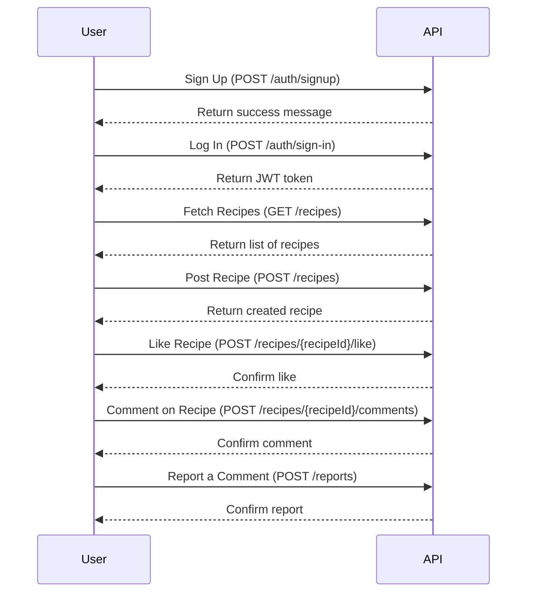

# Use Cases - FeastVerse API

Welcome to the **Use Cases** section of the **FeastVerse** API. This section provides detailed examples of how users interact with the API in various scenarios.

## 1. **Retrieving Recipes**
### Use Case: Fetching all available recipes
**Scenario:** A user wants to browse the list of recipes available on the platform.

**API Request:**
```http
GET /recipes HTTP/1.1
Host: api.feastverse.com
Authorization: Bearer <token>
```

**Expected Response:**
```json
{
  "recipes": [
    {
      "id": "123e4567-e89b-12d3-a456-426614174000",
      "title": "Strawberry Tart",
      "ingredients": ["Strawberry", "Sugar", "Flour"],
      "difficulty": "Easy",
      "prep_time": "30 min"
    },
    ...
  ]
}
```

## 2. **Creating a Recipe**
### Use Case: Submitting a new recipe
**Scenario:** A user wants to share a new recipe with the community.

**API Request:**
```http
POST /recipes HTTP/1.1
Host: api.feastverse.com
Authorization: Bearer <token>
Content-Type: application/json

{
  "title": "Chocolate Cake",
  "ingredients": [
    { "name": "Cocoa Powder", "quantity": 50, "unit": "g" },
    { "name": "Flour", "quantity": 250, "unit": "g" }
  ],
  "steps": [
    "Preheat oven to 180°C.",
    "Mix ingredients.",
    "Bake for 30 minutes."
  ]
}
```

## 3. **User Authentication**
### Use Case: Logging in to access protected resources
**Scenario:** A user wants to log in to their account to post recipes.

**API Request:**
```http
POST /auth/sign-in HTTP/1.1
Host: api.feastverse.com
Content-Type: application/json

{
  "email": "user@example.com",
  "password": "securePassword123"
}
```

**Expected Response:**
```json
{
  "token": "eyJhbGciOiJIUzI1NiIsInR5cCI6IkpXVCJ9..."
}
```

## 4. **Liking a Recipe**
### Use Case: Adding a like to a recipe
**Scenario:** A user wants to like a recipe they enjoyed.

**API Request:**
```http
POST /recipes/{recipeId}/like HTTP/1.1
Host: api.feastverse.com
Authorization: Bearer <token>
```

## 5. **Commenting on a Recipe**
### Use Case: Posting a comment on a recipe
**Scenario:** A user wants to leave feedback on a recipe.

**API Request:**
```http
POST /recipes/{recipeId}/comments HTTP/1.1
Host: api.feastverse.com
Authorization: Bearer <token>
Content-Type: application/json

{
  "content": "This recipe was amazing! I added some vanilla extract for extra flavor."
}
```

## 6. **Reporting Inappropriate Content**
### Use Case: Flagging a comment as inappropriate
**Scenario:** A user encounters an offensive comment and wants to report it.

**API Request:**
```http
POST /reports HTTP/1.1
Host: api.feastverse.com
Authorization: Bearer <token>
Content-Type: application/json

{
  "targetId": "123e4567-e89b-12d3-a456-426614174000",
  "type": "INAPPROPRIATE_CONTENT",
  "description": "This comment contains offensive language."
}
```

## 7. **Full User Journey**
To illustrate how a typical user interacts with the FeastVerse API, the following Mermaid diagram outlines the full process from account creation to recipe interaction.



These are just some of the possible use cases for the **FeastVerse** API. You can explore more functionalities by referring to the full API documentation!