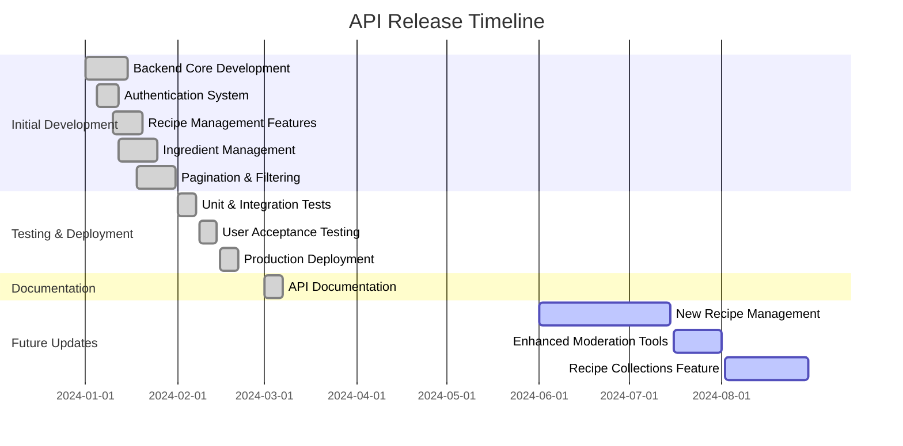
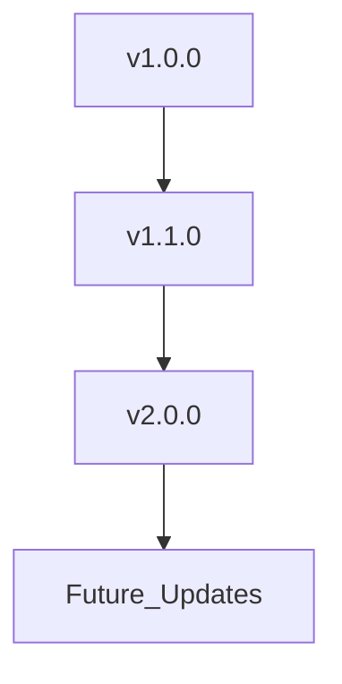

# Changelog - FeastVerse API

This document tracks all major updates, improvements, and fixes to the **FeastVerse API**.

## 📅 Version History

## 🚀 Major Releases

### v1.0.0 - Initial Public Release (February 2024)
- **Implemented Features:**
  - User authentication with JWT
  - Recipe management (Create, Read, Update, Delete)
  - Ingredient database (700+ ingredients)
  - Commenting & reporting system
  - Pagination, filtering, and sorting

### v1.1.0 - Documentation & Stability Enhancements (March 2024)
- **New Features:**
  - Comprehensive API documentation
  - Improved authentication guide
- **Bug Fixes:**
  - Fixed inconsistencies in API response formatting
  - Enhanced error handling

### v2.0.0 - Planned Summer Update (July - August 2024)
- **Upcoming Features:**
  - **Advanced Recipe Management:** Users can fully edit and organize recipes
  - **Improved Moderation Tools:** Admins can better handle reported content
  - **Recipe Collections:** Users can create favorites, saved lists, and planned meals

## 🔄 Version Evolution Diagram

Stay tuned for more updates on the **FeastVerse API**!