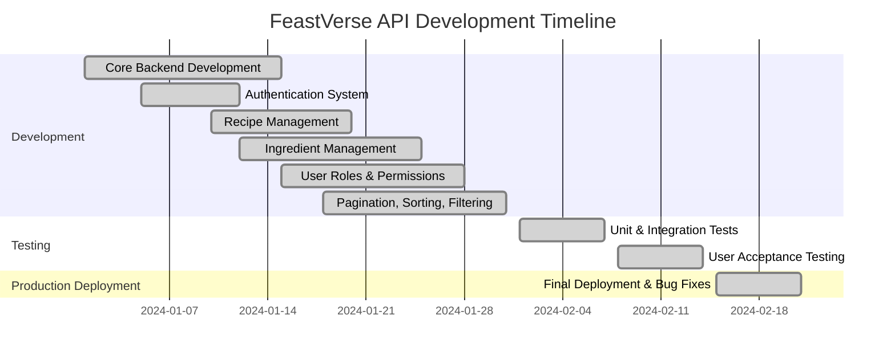
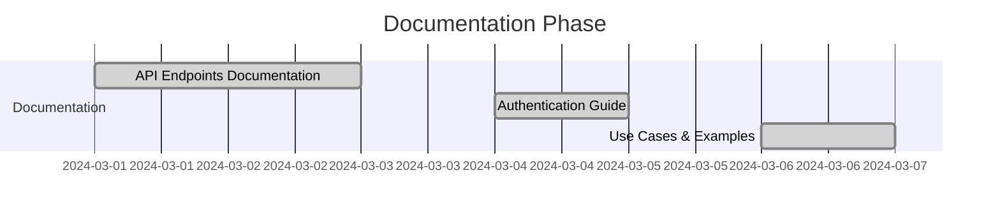
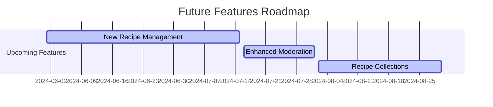

# Roadmap Overview - FeastVerse API

The following roadmap provides an overview of the development, testing, deployment, and future improvements for the **FeastVerse API**.

## 📅 Development Timeline
The initial phase of the project took place from **January to February**, with structured phases:

### Development Breakdown:
- **Core Backend Development:** Initial setup, database schema, and API structure.
- **Authentication System:** Implementation of JWT authentication.
- **Recipe Management:** Handling CRUD operations for recipes.
- **Ingredient Management:** Managing ingredients and types.
- **User Roles & Permissions:** Defining access control for different roles.
- **Pagination, Sorting, Filtering:** Implementing query optimizations.

### Testing & Deployment:
- **Unit & Integration Tests:** Ensuring core functionality.
- **User Acceptance Testing:** Final checks before production.
- **Production Deployment:** Bug fixes and optimizations.

## 📖 Documentation Phase
In **March**, the focus was on refining and constructing the API documentation:

## 🚀 Future Features (Summer 2024)
The next major update for the FeastVerse API is planned for **Summer 2024**, bringing new features and improvements:

### Planned Features:
- **New Recipe Management:** Allowing users to fully create, update, and delete recipes.
- **Enhanced Moderation:** Additional tools for filtering and managing reports.
- **Recipe Collections:** Users will be able to organize recipes into collections (favorites, planned, etc.).

Stay tuned for more updates on the **FeastVerse API** roadmap! 🚀