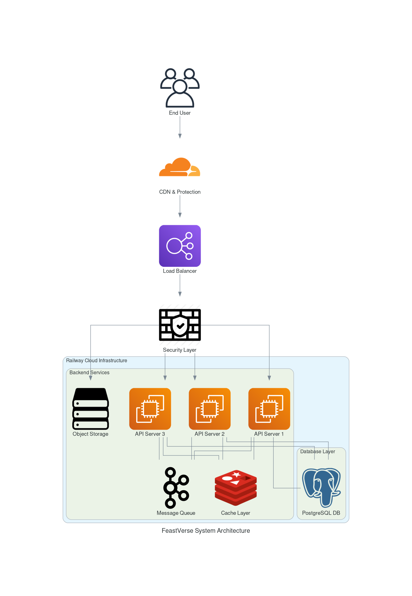
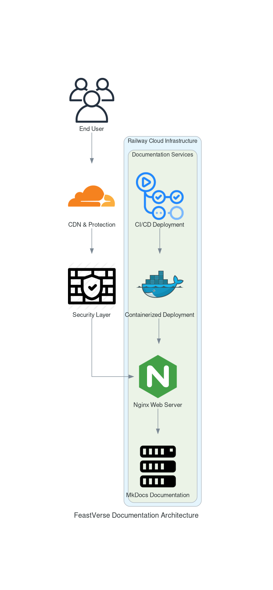

# Architecture - FeastVerse API

## 🌐 System Architecture
The **FeastVerse API** is designed to be **scalable, secure, and efficient**, ensuring high availability and performance. Below is an overview of the core system components and their interactions.

### 📌 **System Infrastructure**
The API is hosted on **Railway**, leveraging containerized backend services, a load balancer, caching, messaging queues, and a PostgreSQL database.

**Key Components:**

- **End Users** interact with the API through requests.
- **Cloudflare CDN** provides protection and caching.
- **Nginx Load Balancer** distributes traffic across multiple API servers.
- **Backend Services** run as multiple scalable instances.
- **Redis Cache** speeds up frequently accessed data.
- **Kafka Queue** handles background processing.
- **PostgreSQL Database** stores structured data.

#### 🖥️ FeastVerse API System Architecture

This diagram illustrates the API’s complete infrastructure.

---

## 📖 Documentation Architecture
The API documentation is served via **MkDocs**, deployed inside a **Docker container** and served through **Nginx** on **Railway**.

**Key Components:**

- **End Users** access the documentation via the web.
- **Cloudflare CDN** ensures fast delivery and protection.
- **Nginx** serves the MkDocs-generated documentation.
- **GitHub Actions** automates CI/CD deployment.
- **Docker** ensures consistency and easy deployment.

#### 📜 FeastVerse Documentation Architecture

This diagram shows how the documentation is structured and deployed.

---

Both architectures ensure a **robust, secure, and highly available** API and documentation system for FeastVerse. 🚀

