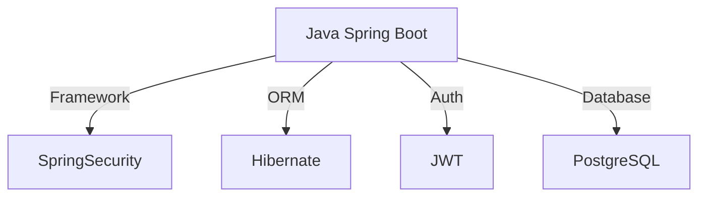
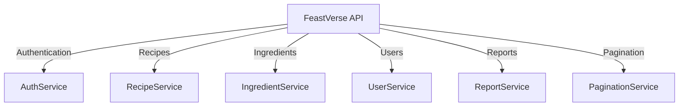
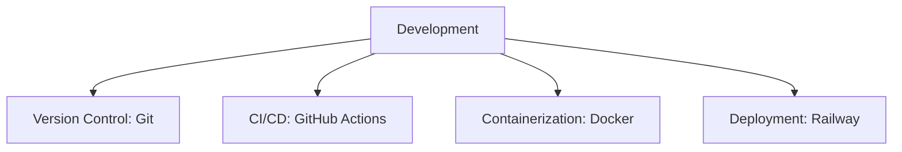
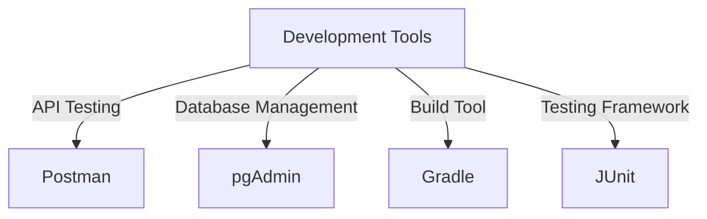

# Tech Stack - FeastVerse API

The **FeastVerse API** is built using a modern and scalable technology stack, ensuring efficiency, security, and maintainability.

## 🔧 Backend

- **[Java Spring Boot](https://spring.io/projects/spring-boot)**: Provides the core framework for the API.
- **[Spring Security](https://spring.io/projects/spring-security)**: Handles authentication and authorization.
- **[JWT (JSON Web Token)](https://jwt.io/)**: Used for secure user authentication.
- **[Hibernate](https://hibernate.org/)**: Manages object-relational mapping.
- **[PostgreSQL](https://www.postgresql.org/)**: Stores all structured data.

## 🌐 API Structure

- **AuthService**: Manages authentication and JWT token issuance.
- **RecipeService**: Handles CRUD operations for recipes.
- **IngredientService**: Manages ingredients and ingredient types.
- **UserService**: Handles user accounts and roles.
- **ReportService**: Manages content moderation and reporting.
- **PaginationService**: Provides optimized paginated responses.

## 🚀 Development & Deployment

- **[Git](https://git-scm.com/)**: Version control for source code.
- **[GitHub Actions](https://github.com/features/actions)**: CI/CD pipeline automation.
- **[Docker](https://www.docker.com/)**: Containerization for easier deployment.
- **[Railway](https://railway.app/)**: Cloud platform for hosting and deployment.

## 🛠️ Tools & Libraries

- **[Postman](https://www.postman.com/)**: API testing and debugging.
- **[pgAdmin](https://www.pgadmin.org/)**: Database management for PostgreSQL.
- **[Gradle](https://gradle.org/)**: Build automation tool.
- **[JUnit](https://junit.org/)**: Unit and integration testing.

The **FeastVerse API** is designed with **scalability, security, and maintainability** in mind, using best practices in modern backend development.